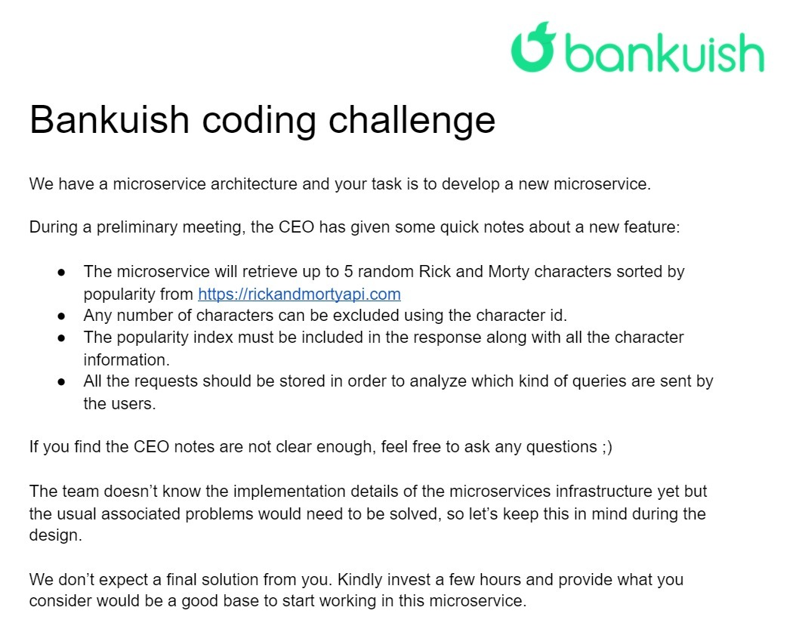
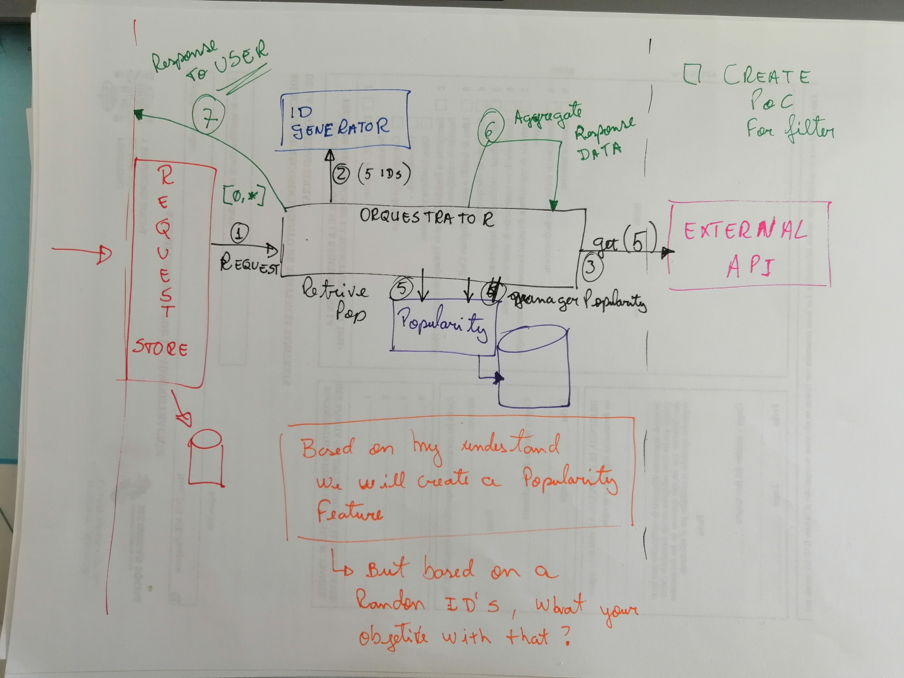
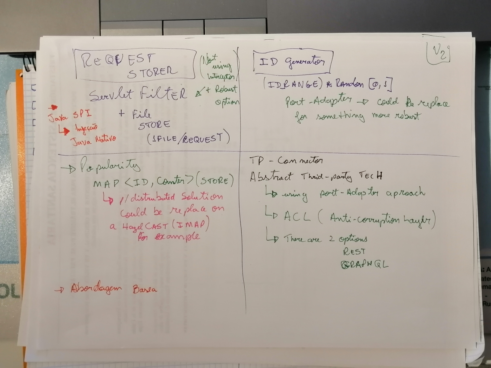

# Bankuish Code Challenge

## Initial information - CEO Notes

## Initial Thoughts
>  Create a new feature adding popularity to the characters.

### Key points
* All request need to be stored, to further analyze about users intention and behavior.
* The original api don't have any information about popularity
* The character's will be chosen at random

> Objective is aggregate som information in the original data 

### First Draft
In this first design will be based on building blocks, each one with your own responsibility.

| Component | Responsibility | Comments |
| ----------- | ----------- | ----------- |
| Request Store |  Store all request made from any user | It's not a feature component, will be use to understand a client behaviour. |
| ID generator | Generate random character id's |  |
| Orchestrator | Will be implement all business logic needed to complete a task |  |
| Popularity Manager | Component to manager a popularity of all characters, storing information to identify each character and his popularity index.  |  |

### Proof of Concepts

#### Design considerations

* Microservice infrastructure not defined, then could be using a port adapter approach. That could be maintained design decisions, creating consistent interfaces.
* There are two different ways to consume the API, an abstraction layer should be created so that the technology chosen today, for example, for reasons of proof of concepts, does not affect the choice of the best form of consumption for the real case, creating this layer of abstraction can be alters the implementation of consumption, so we would have an ACL (anti-corruption layer) approach

| Component | Technology | Motivation |
| :-----------: | :-----------: | ----------- |
| Request Store      | Servlet filter and SPI (Java service Provider Interface) |  1. **Servlet filter** - it's more robust than Spring interceptors / 2. **SPI** - to create a injection mechanism |
| ID generator       | Java Random number | For proof need it's enough, but will be using all design considerations with port-adapter approach,  that way could be replace with something more robust |
| Orchestrator       | Java | As Doug Cutting would say, because I know java. (Answering why Hadoop was programmed in java) |
| Popularity Manager | Java HashMap | For make simple implementation and mechanism (a key and a value that could be a complex structure, with need of schema) |

#### Stack chosen 
> Spring Boot and Spring will be used, because the ease and speed of implementing a proof of concept and that makes a great use of the port-adapter approach